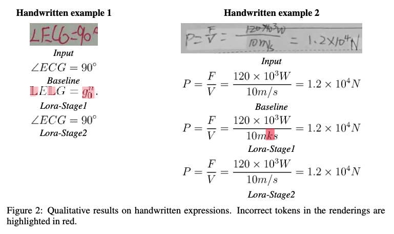

# MLLM Fine-tuning for Mathematical Expression Recognition (MER)

This repository contains the code and resources for the project "Fine-tuning Qwen2.5-VL for Enhanced Mathematical Expression Recognition", which focuses on adapting the Qwen2.5-VL-3B-Instruct multimodal large language model (MLLM) for recognizing printed and handwritten mathematical expressions using Low-Rank Adaptation (LoRA).

## Overview

Mathematical Expression Recognition (MER) converts images of formulas into structured formats like LaTeX. Traditional methods often struggle with diverse inputs. This project leverages the power of MLLMs by fine-tuning Qwen2.5-VL-Instruct (3B) for MER. We employ:

*   **LoRA Fine-tuning:** Efficiently adapts the large model for the specific task of MER.
*   **Two-Stage Strategy:**
    1.  Fine-tuning on a large dataset of **printed** formulas.
    2.  Brief subsequent fine-tuning on **handwritten** formulas to mitigate catastrophic forgetting and restore performance on that domain.
*   **Comprehensive Evaluation:** Uses standard metrics (BLEU, Edit Distance) and rendering-based metrics (CDM, ExpRate@CDM) on in-domain, out-of-distribution (OOD), and handwritten datasets.

## Features

*   End-to-end MER using a powerful MLLM (Qwen2.5-VL-3B-Instruct).
*   Parameter-efficient fine-tuning via LoRA.
*   Demonstrated mitigation of catastrophic forgetting for handwritten data.
*   Scripts for data preprocessing, training, inference, and evaluation.
*   Evaluation across diverse printed, handwritten, and OOD datasets.

## Environment Setup

1.  **Clone the repository:**
    ```bash
    git clone https://github.com/Evvvvvvvva/qwen-ocr.git
    cd qwen-ocr
    ```

2.  **Create a virtual environment (recommended):**
    ```bash
    # Tested on A6000, cuda=12.2, nv-driver=535.216.03
    conda create --name qwen-ocr python=3.12
    conda activate qwen-ocr
    ```

3.  **Install dependencies:**
    ```bash
    pip install git+https://github.com/huggingface/transformers.git accelerate
    pip install qwen-vl-utils[decord]==0.0.8
    pip install datasets pillow matplotlib requests flash-attn torchvision peft
    pip install scikit-image evaluate anls RapidFuzz
    pip install huggingface_hub
    # Download pretrained qwen
    huggingface-cli download --resume-download --local-dir-use-symlinks False Qwen/Qwen2.5-VL-3B-Instruct --local-dir ./Qwen2.5-VL-3B-Instruct-Pretrained
    # Assume NodeJS, pdflatex, gs are installed
    # Training Pipeline
    git clone --depth 1 https://github.com/hiyouga/LLaMA-Factory.git
    cd LLaMA-Factory
    pip install -e ".[torch,metrics]"
    pip install wandb # Setup your WandDB account
    # Update dataset info to include our datasets
    cp ../dataset_info.json data/dataset_info.json
    ```

## Data Preprocessing

This project utilizes several datasets. You will need to download and preprocess them.

1.  **Datasets:**
    *   **Printed MER (Train/Val/Test):** `OleehyO/latex-formulas` from Hugging Face Hub.
        *   Requires filtering, LaTeX tokenization (splitting symbols by space), and validation (e.g., using KaTeX/QuickLaTeX rendering checks).
        *   The project used a subset (53k train / 800 val / 1k test). You may need to implement sampling.
    *   **Handwritten HMER (Train/Val/Test):** CROHME + HME100k.
        *   LaTeX is generally pre-tokenized.
        *   The project used a subset (2k train / 100 val / 100 test for Stage 2).
    *   **OOD - Pix2Tex (Test):** Official test split from the [LaTeX-OCR GitHub](https://github.com/lukas-blecher/LaTeX-OCR). Included in `wanderkid/UniMER_Dataset`. Sampled 100 instances for evaluation.
    *   **OOD - SCE (Test):** Screen-captured expressions also from `wanderkid/UniMER_Dataset`. Sampled 100 instances for evaluation.

2.  **Preprocessing Steps:**
    *   **Download:** Use the `datasets` library or download manually.
    *   **Tokenize LaTeX:** Ensure LaTeX strings have symbols separated by spaces (e.g., `a + b` instead of `a+b`).
    *   **Format:** Convert data into the ShareGPT chat format expected by the training pipeline (e.g., `llama-factory`). This involves structuring the input as conversations with system prompts, user instructions (containing the image placeholder), and assistant responses (the ground truth LaTeX).
    *   **Save:** Store processed data in Parquet files (e.g., `data/processed/train.parquet`, `data/processed/validation.parquet`, etc.).
    *   **Script:** Please run `python preprocess_data.py` for data preprocessing.
  
## Fine-tuning

Fine-tuning is performed in two stages using LoRA. The report mentions using the `llama-factory` framework. Run `bash run_trainer.sh`

**Stage 1: Printed Formula Fine-tuning**

*   **Goal:** Adapt the model to recognize printed mathematical expressions.
*   **Data:** Use the processed printed MER dataset `latex-formulas-tokenized`.
*   **Command (Example using `llama-factory`):**
    ```bash
    CUDA_VISIBLE_DEVICES=0 llamafactory-cli train qwen2.5vl_lora_ocr_stg1.yaml
    ```

**Stage 2: Handwritten Formula Rehearsal**

*   **Goal:** Mitigate catastrophic forgetting and restore/enhance handwritten MER performance.
*   **Data:** Use the processed handwritten HMER dataset `hmer-stg2-processed`.
*   **Command (Example using `llama-factory`, resuming from Stage 1):**
    ```bash
    CUDA_VISIBLE_DEVICES=0 llamafactory-cli train qwen2.5vl_lora_ocr_stg2.yaml
    ```

## Inference

Use the fine-tuned LoRA weights (from Stage 1 or Stage 2) for inference on new images.

Example Usage 1: running inference for test set
```bash
python qwen_inference.py --lora-ckpt {path-to-ckpt} --dataset hmer-stg2-processed 
```

Example Usage 2: running inference for single image
```bash
python qwen_inference.py --lora-ckpt {path-to-ckpt} --image-path qualitative_examples/6859.jpg
```

## Evaluation
To evaluate the model's performance using BLEU, Edit Distance, CDM, and ExpRate@CDM:

1. Prepare Evaluation Data: Ensure your test datasets (MER-test, HMER-test, Pix2Tex-test sample, SCE sample) are preprocessed and accessible.

2. Run Evaluation Script: `bash run_evaluation.sh`

3. Check Results: The script should output the calculated metrics to the console or save them to a file in the specified output directory.

## Results Summary
Our fine-tuned model demonstrates significant improvements over the base Qwen2.5-VL-Instruct model:

Printed MER (MER-test): ExpRate@CDM improved from 0.36 (base) to 0.54 (Stage 2).
| **Model**               | BLEU ↑ | Edit ↓ | CDM ↑ | Exp@CDM ↑ |
|-------------------------|--------|--------|--------|------------|
| Qwen2.5‑VL (base)       | 0.68   | 0.167  | 0.91   | 0.36       |
| **Ours (fine‑tuned)**   | **0.87** | **0.084** | **0.96** | **0.54**   |

**Table1:** In‑domain performance on the `MER‑test` set.

OOD Generalization: Showed improved structural understanding (CDM, ExpRate@CDM) on Pix2Tex and SCE datasets even when BLEU scores were similar.
| **Model**               | **BLEU ↑** | **CDM ↑** | **Exp@CDM ↑** | **BLEU ↑** | **CDM ↑** | **Exp@CDM ↑** |
|-------------------------|------------|-----------|----------------|------------|-----------|----------------|
|                         || **Pix2Tex**      | ||**SCE**         |
| Qwen2.5‑VL (base)       | **0.76**   | 0.86      | 0.36           | 0.56       | 0.84      | 0.67           |
| **Ours (fine‑tuned)**   | 0.75       | **0.91**  | **0.45**       | **0.58**   | **0.94**  | **0.76**       |

**Table2:** Out‑of‑domain performance on `Pix2Tex` and `SCE` (screen‑capture) datasets. *Edit‑distance columns are omitted for concision.*


Handwritten HMER (HMER-test): Stage 2 successfully recovered performance lost after Stage 1, achieving ExpRate@CDM of 0.50 (vs. 0.48 baseline, 0.39 Stage 1).
| **Model**       | **BLEU ↑** | **CDM ↑** | **Exp@CDM ↑** | **BLEU ↑** | **CDM ↑** | **Exp@CDM ↑** |
|------------------|------------|-----------|----------------|------------|-----------|----------------|
|                  || **MER‑test**||       | **HMER‑test**       |
| Baseline         | 0.68       | 0.91      | 0.36           | **0.89**   | 0.87      | 0.48           |
| LoRA‑Stage 1     | **0.88**   | **0.96**  | **0.54**       | 0.68       | 0.84      | 0.39           |
| LoRA‑Stage 2     | 0.87       | **0.96**  | **0.54**       | 0.82       | **0.89**  | **0.50**       |

**Table:** Ablation study illustrating the impact of Stage‑1 printed fine‑tuning and Stage‑2 handwritten rehearsal. *Edit‑distance columns are omitted for concision; CDM and Exp@CDM capture structural fidelity.*

Refer to Tables 1, 2, and 3 in the project report for detailed quantitative results.
## Example Outputs

### Printed Formula Example


### Handwritten Formula Example



Qualitative examples are saved in `./qualitative_examples`

## Acknowledgement
* [LLaMA‑Factory](https://github.com/hiyouga/LLaMA-Factory) Traning Pipeline
* [CDM](https://github.com/opendatalab/UniMERNet/tree/main/cdm) Image-based formula2latex evaluation metric

